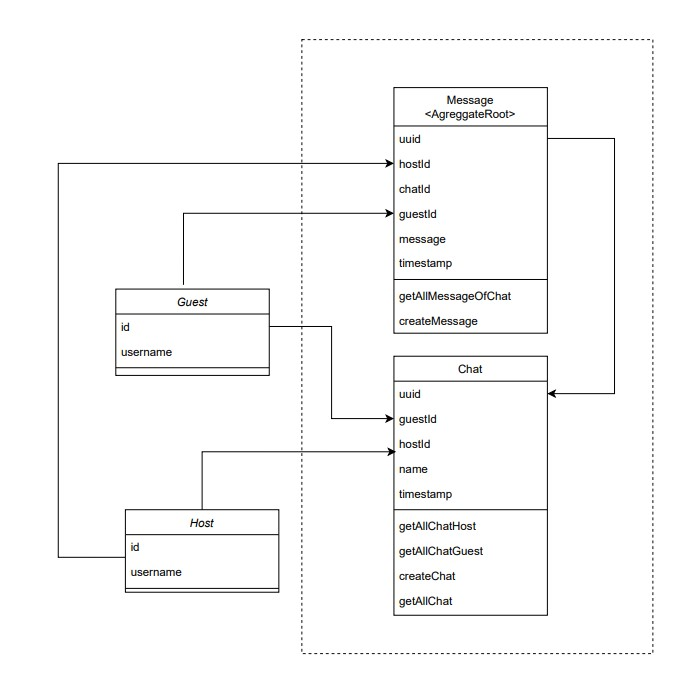

# Chat

El microservicio de Chat se encarga de gestionar la mensajería dentro de la aplicación, facilitando la comunicación entre huéspedes y anfitriones.

Para utilizar el microservicio de Chat, los usuarios pueden:

- Enviar mensajes a otros usuarios, ya sean anfitriones o huéspedes.
- Crear nuevas conversaciones con los usuarios correspondientes.
- Consultar el historial de sus conversaciones anteriores para revisar mensajes antiguos.

Este microservicio juega un papel clave en facilitar la comunicación efectiva entre los diferentes actores en la plataforma.

## Funcionalidades Principales

### Envío y Recepción de Mensajes
Los usuarios, tanto anfitriones como huéspedes, pueden enviar y recibir mensajes entre ellos. El microservicio asegura la entrega confiable de los mensajes a los destinatarios.

### Creación de Chats
Los usuarios tienen la capacidad de crear conversaciones con los correspondientes anfitriones o huéspedes. Esto permite que se inicie una comunicación fluida y personalizada.

### Consulta de Historial de Conversaciones
Los usuarios pueden acceder al historial de conversaciones anteriores. Esto incluye la posibilidad de ver los mensajes que han sido enviados y recibidos en el contexto de una conversación específica.

